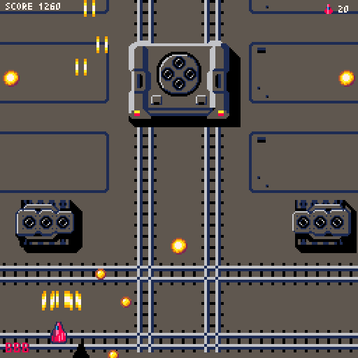
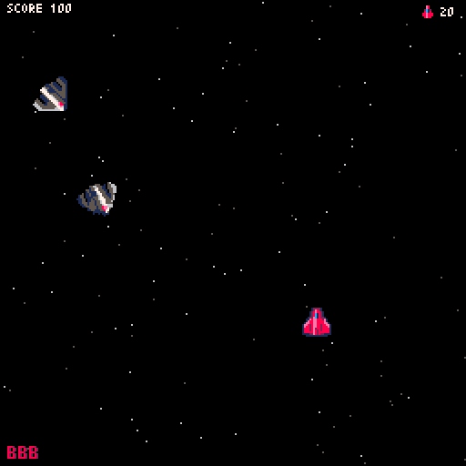

# GRA-DEN
GRA-DENは某雷○風シューティングゲームで、昔学生時代に作ったゲームも元にしています。

## 動作環境
Pyxelというクラシックゲームエンジンで動作します。PyxelはPython3用の追加ライブラリです。Pyxelに関しては以下のサイトをご覧ください。

<https://github.com/kitao/pyxel/blob/master/README.ja.md>

## インストール方法
まずはPython3をインストールしてください。
その後、以下のように実行してPyxelライブラリを追加してください。

`pip install -U pyxel`

## 実行方法
source配下のファイルを一式ダウンロードし、以下のように実行してください。

`python graden.py`

## 操作方法
* カーソルキーで移動
* SHIFTキーでショット、Zキーでボム。あるいは
* ESCキーでプログラム終了
* PCのゲームコントローラでも操作できます。PS4のコントローラもUSB接続で可能です。
* メニューでの決定もSHIFTキーです。
* 難しい！という方はOPTIONで残機を増やしてください。難易度変更はまだこれからです。
* 一部のPCでサウンドをONにすると落ちることがあるようです。この場合はOPTIONでSOUNDをOFFにしてください。

## 注意事項
* お約束ですが、このソフトウェアにはなんの保証もついていません。例えこのソフトウェアを利用したことでなにか問題が発生しても、作者はなんの責任も負いません。
